# 🐳 Docker Integration Host

## 📋 Table of Contents

1. [Overview](#overview)
2. [Key Features](#-key-features)
3. [Architecture](#️-architecture)
4. [Setup Instructions](#️-setup-instructions)
5. [Technology Stack](#️-technology-stack)
6. [Usage Guide](#-usage-guide)
7. [Planned Enhancements](#-planned-enhancements)

## Overview

**Docker Integration Host** is a centralized platform for managing multiple Docker daemons across different hosts. It simplifies container orchestration by providing a unified interface for container lifecycle management, network and volume configuration, live monitoring, image handling, and command execution.

This tool is designed for developers, DevOps engineers, and teams working with distributed containerized environments.

---

## 🚀 Key Features

### 🔌 Multi-Daemon Support
Connect and manage multiple remote Docker daemons from a single host interface.

### 🐳 Container Lifecycle Management
- Create, start, stop, restart, and delete containers
- Inspect container details and metadata

### 🌐 Network Management
- Create and delete Docker networks
- Attach/detach containers from networks

### 📂 Volume and Bind Mounts
- Create and delete volumes
- Configure bind mounts for persistent storage and host access

### 🖼️ Image Management
- Pull images from Docker Hub or private registries
- Build and manage custom images

### 📜 Live Logs and Interactive Execution
- View real-time logs from running containers
- WebSocket-powered terminals for executing commands inside containers

### 📊 Live Resource Monitoring
- Monitor CPU, memory, and network usage in real-time

### 🔒 Secure Access
- JWT-based authentication for REST APIs and WebSocket communication

---

## 🏗️ Architecture



### Architecture Components

**Frontend Layer**: React-based user interface with Tailwind CSS for styling, providing an intuitive dashboard for Docker management.

**API Gateway**: Dual-channel communication system with Django REST API for standard operations and WebSocket server for real-time data streaming.

**Backend Services**: Modular service architecture handling specific Docker operations:
- Container lifecycle management
- Network configuration
- Volume management  
- Image handling
- Resource monitoring
- Log streaming

**Docker Hosts**: Multiple remote Docker daemons managed through the centralized interface.

---

## ⚙️ Setup Instructions

### 🔧 Backend Setup (Django + Daphne)

```bash
cd backend
python -m venv venv          # Create virtual environment
source venv/bin/activate     # Linux/macOS
# venv\Scripts\activate      # Windows

pip install -r requirements.txt
daphne home.asgi:application
```

### ⚛️ Frontend Setup (React + Tailwind + Vite)

```bash
cd frontend
npm install
npm run dev
```

---

## 🛠️ Technology Stack

### 🧠 Backend Technologies
- **Django REST Framework** – Scalable API development
- **Django Channels** – WebSocket support for real-time communication
- **Daphne** – ASGI server for HTTP and WebSocket handling
- **JWT Authentication** – Secure token-based authentication

### 🎨 Frontend Technologies
- **React** – Component-based UI framework
- **Tailwind CSS** – Utility-first CSS framework
- **Vite** – Fast development server and build tool

---

## 📖 Usage Guide

### 🔐 Authentication and Dashboard
After successful login, you'll access the **Dashboard** displaying all connected Docker hosts. Use **Create Host** to add new Docker daemon connections.

### 🖥️ Host Management
Select any connected host to access its management interface with four main sections:

#### 🐳 Containers Section
- View all existing containers
- Create new containers using the **Create Container** button
- Access individual container management:
  - View details and metadata
  - Monitor live logs
  - Track CPU, memory, and network statistics
  - Control container lifecycle (start, stop, restart, delete)
  - Execute terminal commands
  - Manage network attachments
  - Configure volume bindings

#### 📂 Volumes Section
- Browse available volumes
- Create new volumes
- Delete existing volumes

#### 🌐 Networks Section
- List and manage Docker networks
- Create custom networks
- Delete networks
- Manage container network attachments

#### 🖼️ Images Section
- Browse Docker images on the host
- Pull images from registries
- Delete unused images
- Build custom images

---

## 🔮 Planned Enhancements

- 📦 **Docker Compose Integration** – Support for grouped container deployments
- 👥 **Role-Based Access Control** – Multi-user collaboration with permissions
- 🌐 **Visual Network Topology** – Graph-based container relationship visualization
- 📈 **Historical Analytics** – Metrics dashboard with historical data
- 🛠️ **CLI Client** – Command-line interface for advanced users